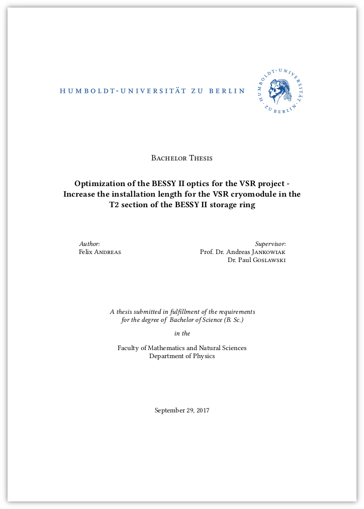

# Bachelor Thesis

    

    <b>Thesis:</b>
    <a href="https://nbviewer.jupyter.org/github/andreasfelix/bachelor-thesis/blob/main/thesis.pdf">
        View
    </a>
    <a href="https://github.com/andreasfelix/bachelor-thesis/raw/main/thesis.pdf">
         Download
    </a>
     
    <b>Defense:</b>
    <a href="https://nbviewer.jupyter.org/github/andreasfelix/bachelor-thesis/blob/main/defense.pdf" title="View">
        View
    </a>
    <a href="https://github.com/andreasfelix/bachelor-thesis/raw/main/defense.pdf" title="Download">
         Download
    </a>

- **Title:** Optimization of the BESSY II optics for the VSR project - Increase the installation length for the VSR cryomodule in the T2 section of the BESSY II storage ring
- **Author:** Felix Andreas
- **Supervisors:** Prof. Dr. Andreas Jankowiak and Dr. Paul Goslawski
- **Institution:** [Department of Physics, Faculty of Mathematics and Natural Sciences, Humboldt University of Berlin](https://www.physik.hu-berlin.de)
- **Date:** September 29, 2017
- **Abstract:** BESSY II is a third generation synchrotron light source located in Berlin Adlershof. It purpose is to provide extremely brilliant synchrotron light pulses in the range from long terahertz radiation to hard X-rays. In the last several years, there is a continuously increasing interest in the short pulse operation. Therefore the next major upgrade is to enable a storage ring with short and long pulses, simultaneously. This variable pulse-length storage ring can be achieved due to the installation of additional superconducting high gradient cavities. The cavities will be assembled into one cryomodule in the T2 section of the storage ring. As this module needs more space then initially assumed, the idea is to remove two quadrupoles to gain installation length. Linear beam optics computations with an optimization method were used to switch off the quadrupoles in simulations. The different theoretical optics obtained were transfered to the storage ring. For the best solution it was possible to store high current with reasonable injection efficiency and lifetime. The proposed optics of this thesis has to be further optimized in regards to non-linear beam dynamics, but has shown that an enlargement of the installation length is possible.
